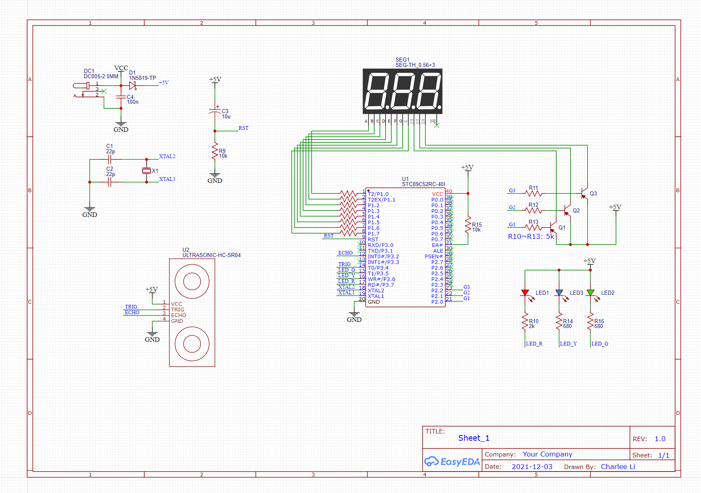

Parking Radar
==============

This is a "parking radar" that can be installed on the wall of your garage.
When parking in the garage, it will show the distance between your car and the wall,
preventing you from accidentally crashing into the wall.

## Hardware

The hardware consists of the following parts:

- A 40pin through-hole MCS51 MCU (AT89C52 used in this project)
- A 6MHz crystal
- Ultrasonic module: HC-SR04
- A 3-digit seven segment display
- 3 3mm LEDs, red/yellow/green
- Resistors:
  - 680Ω x 11
  - 10kΩ x 2
  - 5kΩ x 3
- Capacitors:
  - 22pF ceramic capators x 2
  - 100nF (104) ceramic capator x 1
  - 10μF electrolytic capator x 1
- NPN Transistors (any type, S9012 used in this project) x 3
- A Schottky diode (1N5819 used here)
- A DC connector
- A 7cm x 10cm single-sided perfboard


## Schematic




## Software

The program is written in C and is compiled with [SDCC](http://sdcc.sourceforge.net/).
Tested under Windows 10.  Run the following command to build:

```
> cd src
> make
```

If you need `make` command, please install it with [chololatey](https://chocolatey.org/):

```
(Adminstrator) > chocolatey install make
```

Download the generated `parking-radar.hex` to your MCS51 MCU.


## Case

The case is 3D printed. You can find the STL files and the Sketchup source file in the [3dmodels](3dmodels) directory.
